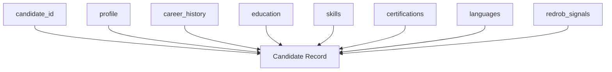

# Actual Dataset Analysis

**Project:** MiraiKhoj  
**Tagline:** _Finding Talent Beyond Keywords._  
**Context:** Redrob Data & AI Challenge

## Executive Summary

The actual Redrob challenge dataset is materially more structured than the current codebase assumes. The true record format is centered on a nested profile object, structured career history, structured education, structured skills, optional certifications, optional languages, and a required `redrob_signals` object containing 23 behavioral fields.

The sample corpus is internally consistent across all 50 records inspected:

- Every sample record contains all required top-level fields from the schema.
- Every sample record contains all required fields inside `profile`, `career_history`, `education`, `skills`, and `redrob_signals`.
- `certifications` and `languages` are present as arrays, but `certifications` is optional and often empty.
- The dataset is designed for ranking systems that can use both static profile quality and dynamic behavioral signals.

## Source Artifacts Reviewed

- [candidate_schema.json](../data/raw/candidate_schema.json)
- [sample_candidates.json](../data/raw/sample_candidates.json)
- [candidates.jsonl](../data/raw/candidates.jsonl)
- [redrob_signals_doc.docx](../data/docs/redrob_signals_doc.docx)

## Dataset Shape

### Candidate Corpus Size

- `candidates.jsonl` contains 100,000 rows.
- `sample_candidates.json` contains 50 candidate records.

### High-Level Record Structure

The real record shape is:



## Top-Level Fields

The schema and sample data define the following top-level fields:

| Field | Type | Required | Observed in Sample | Notes |
| --- | --- | --- | --- | --- |
| `candidate_id` | string | Yes | Yes | Patterned as `CAND_0000001` style identifiers |
| `profile` | object | Yes | Yes | Nested identity and current-role metadata |
| `career_history` | array of objects | Yes | Yes | Structured chronology of past roles |
| `education` | array of objects | Yes in schema | Yes | Variable-length academic history |
| `skills` | array of objects | Yes | Yes | Structured skill objects, not a flat string list |
| `certifications` | array of objects | No | Yes | Present but often empty |
| `languages` | array of objects | No | Yes | Present in sample though not mandatory |
| `redrob_signals` | object | Yes | Yes | 23 behavioral and trust signals |

## Nested `profile` Object

The `profile` object is mandatory and contains the following fields:

| Field | Type | Required | Observed in Sample | Notes |
| --- | --- | --- | --- | --- |
| `anonymized_name` | string | Yes | Yes | Anonymous display name |
| `headline` | string | Yes | Yes | Short professional positioning |
| `summary` | string | Yes | Yes | Multi-sentence profile summary |
| `location` | string | Yes | Yes | City / region / state |
| `country` | string | Yes | Yes | Country name |
| `years_of_experience` | number | Yes | Yes | Decimal years are used in sample data |
| `current_title` | string | Yes | Yes | Current role title |
| `current_company` | string | Yes | Yes | Current employer |
| `current_company_size` | enum string | Yes | Yes | Values such as `10001+`, `201-500`, `11-50` |
| `current_industry` | string | Yes | Yes | Industry classification |

### Observed Profile Patterns

- Headlines are short, role-centric strings such as `Backend Engineer | SQL, Spark, Cloud`.
- Summaries often include explicit years of experience and narrative career intent.
- Current-company metadata is used consistently in the sample set.
- Years of experience are non-integer in multiple cases, such as `6.9` and `12.5`.

## Nested `career_history` Objects

Each `career_history` entry is a structured object with the following fields:

| Field | Type | Required | Observed in Sample | Notes |
| --- | --- | --- | --- | --- |
| `company` | string | Yes | Yes | Previous employer or current employer |
| `title` | string | Yes | Yes | Role title for that stint |
| `start_date` | date string | Yes | Yes | ISO date format |
| `end_date` | date string or null | Yes | Yes | Null for current role |
| `duration_months` | integer | Yes | Yes | Explicit month count |
| `is_current` | boolean | Yes | Yes | Current position flag |
| `industry` | string | Yes | Yes | Industry classification |
| `company_size` | enum string | Yes | Yes | Same enum family as current company size |
| `description` | string | Yes | Yes | Responsibilities and achievements |

### Career History Observations

- Sample records average about **2.94** career-history entries.
- The dataset is not a simple résumé summary; it is a structured career timeline.
- Some descriptions are rich and detailed enough for retrieval, career-intelligence, and honeypot analysis.

## Nested `education` Objects

Each education entry contains:

| Field | Type | Required | Observed in Sample | Notes |
| --- | --- | --- | --- | --- |
| `institution` | string | Yes | Yes | University or college name |
| `degree` | string | Yes | Yes | Degree label |
| `field_of_study` | string | Yes | Yes | Program specialization |
| `start_year` | integer | Yes | Yes | Academic start year |
| `end_year` | integer | Yes | Yes | Academic end year |
| `grade` | string or null | No | Yes | CGPA, percentage, or class |
| `tier` | enum string | No | Yes | Institution tier label |

### Education Observations

- Sample records average about **1.44** education entries.
- `tier` is used as an internal prestige proxy and ranges from `tier_1` to `tier_4` plus `unknown` in the schema.
- Grade formats vary by record, including `CGPA`, percentages, and class-style labels.

## Nested `skills` Objects

Each skill entry contains:

| Field | Type | Required | Observed in Sample | Notes |
| --- | --- | --- | --- | --- |
| `name` | string | Yes | Yes | Skill label |
| `proficiency` | enum string | Yes | Yes | `beginner`, `intermediate`, `advanced`, `expert` |
| `endorsements` | integer | Yes | Yes | Non-negative endorsements count |
| `duration_months` | integer | No | Yes | Optional in schema, present in sample |

### Skills Observations

- Sample records average about **9.4** skills each.
- Skills are stored as objects, not free-text tags.
- The dataset includes both technical and non-technical skills, including engineering stacks, management skills, and domain-specific tools.
- Several sample profiles contain skill objects relevant to AI, retrieval, search, ranking, and platform engineering.

## Nested `certifications` Objects

Each certification entry contains:

| Field | Type | Required | Observed in Sample | Notes |
| --- | --- | --- | --- | --- |
| `name` | string | Yes | Yes when present | Certification name |
| `issuer` | string | Yes | Yes when present | Issuing body |
| `year` | integer | Yes | Yes when present | Issuance year |

### Certifications Observations

- Certifications are optional in the schema.
- In the sample corpus, **14 of 50** records contain at least one certification.
- Several profiles have an empty certifications array, which is valid.

## Nested `languages` Objects

The schema includes `languages` as a repeatable optional array, and the sample corpus uses it consistently.

| Field | Type | Required | Observed in Sample | Notes |
| --- | --- | --- | --- | --- |
| `language` | string | Yes | Yes | Human language |
| `proficiency` | enum string | Yes | Yes | `basic`, `conversational`, `professional`, `native` |

### Languages Observations

- All 50 sample records include a `languages` array.
- English and Hindi are common in the sample set.

## Behavioral Signal Fields

The `redrob_signals` object is mandatory and contains 23 fields.
The accompanying DOCX explains that these signals represent actual platform behavior, not profile claims, and are intended to improve ranking quality beyond static résumé similarity.

### Required `redrob_signals` Fields

| Field | Type | Notes |
| --- | --- | --- |
| `profile_completeness_score` | number | Percent-like completeness score |
| `signup_date` | date string | Account creation date |
| `last_active_date` | date string | Most recent activity |
| `open_to_work_flag` | boolean | Availability signal |
| `profile_views_received_30d` | integer | Visibility signal |
| `applications_submitted_30d` | integer | Engagement signal |
| `recruiter_response_rate` | number | Response fraction |
| `avg_response_time_hours` | number | Responsiveness in hours |
| `skill_assessment_scores` | object | Per-skill scores keyed by skill name |
| `connection_count` | integer | Social graph size |
| `endorsements_received` | integer | Trust signal |
| `notice_period_days` | integer | Joinability constraint |
| `expected_salary_range_inr_lpa` | object | Salary expectations with `min` and `max` |
| `preferred_work_mode` | string | `remote`, `hybrid`, `onsite`, `flexible` |
| `willing_to_relocate` | boolean | Mobility signal |
| `github_activity_score` | number | Public engineering activity; may be `-1` if unlinked |
| `search_appearance_30d` | integer | Recruiter search visibility |
| `saved_by_recruiters_30d` | integer | Recruiter interest |
| `interview_completion_rate` | number | Interview attendance fraction |
| `offer_acceptance_rate` | number | May be `-1` when no history exists |
| `verified_email` | boolean | Account verification |
| `verified_phone` | boolean | Account verification |
| `linkedin_connected` | boolean | LinkedIn connection flag |

### Behavioral Interpretation

The DOCX describes these signals as a proxy for real recruiting feasibility:

- recent activity
- responsiveness
- assessment completion
- recruiter interest
- visibility
- interview completion

This means the ranking system should treat `redrob_signals` as first-class evidence rather than auxiliary metadata.

## Mandatory vs Optional Fields

### Mandatory Top-Level Fields

- `candidate_id`
- `profile`
- `career_history`
- `education`
- `skills`
- `redrob_signals`

### Optional Top-Level Fields

- `certifications`
- `languages`

### Mandatory Nested Fields

- All fields inside `profile`
- All fields inside each `career_history` item
- All required fields inside each `education` item
- All required fields inside each `skill` item
- All required fields inside each `redrob_signals` item

### Optional Nested Fields

- `grade` and `tier` in education
- `duration_months` in skills
- `certifications` as a top-level array may be empty

## Schema vs Sample Consistency

The sample corpus matches the schema closely:

- 50 / 50 sample records contain every required top-level field.
- 50 / 50 sample records contain every required `profile` field.
- 50 / 50 sample records contain valid `redrob_signals` objects.
- 50 / 50 sample records contain `languages`.
- 14 / 50 sample records contain certifications.

## Data Quality Notes

A few real-data quirks were observed:

- Some summaries repeat a generic narrative pattern across multiple records.
- Some career-history descriptions appear stylistically inconsistent with the title label, which suggests the dataset may have been synthesized or partially templated.
- Some salary ranges appear inverted or inconsistent in the sample, such as a record with `min` greater than `max`.
- `github_activity_score` may be `-1`, which should be interpreted as missing rather than negative activity.

## Implications for Ranking Systems

MiraiKhoj should treat the dataset as:

- structured at the object level,
- rich in behavioral metadata,
- noisy in natural-language descriptions,
- and suitable for explainable multi-signal ranking.

## Mermaid Field Map

```mermaid
flowchart TD
    R[Candidate Record] --> P[profile]
    R --> H[career_history[]]
    R --> E[education[]]
    R --> S[skills[]]
    R --> C[certifications[]]
    R --> L[languages[]]
    R --> B[redrob_signals]

    B --> B1[activity]
    B --> B2[responsiveness]
    B --> B3[trust]
    B --> B4[visibility]
    B --> B5[availability]
```
