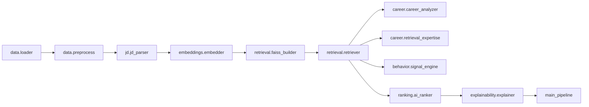

# API Reference

This document describes the primary code-level interfaces in MiraiKhoj. It is intended for developers integrating, extending, or testing the system.

## Naming Convention

Public classes and functions are organized by module.

## `src/data/loader.py`

### `iter_candidate_records(jsonl_path)`

Iterates over a candidate JSONL file and yields normalized candidate records.

**Behavior**

- Skips blank lines
- Logs malformed JSON rows
- Skips non-object rows
- Fills missing values with safe defaults

### `load_candidates(jsonl_path)`

Loads the candidate corpus into a pandas DataFrame.

**Returns**

- `DataFrame` with normalized candidate columns and a canonical `candidate_text` field

### `process_candidates_jsonl(jsonl_path, output_path)`

Processes candidate data and writes a parquet snapshot.

**Returns**

- Normalized DataFrame

## `src/data/preprocess.py`

### `clean_candidate_text(candidate_text)`

Normalizes whitespace in the canonical candidate text.

### `split_candidate_text(candidate_text)`

Splits canonical text into logical sections.

## `src/jd/jd_parser.py`

### `JDParser.parse(job_description)`

Parses raw job description text into a structured `ParsedJD` object.

**Returns**

- Required skills
- Preferred skills
- Experience range
- Locations
- Role seniority
- Domain keywords
- Evaluation metrics

### `JDParser.parse_json(job_description)`

Returns the parsed JD as a JSON string.

## `src/embeddings/embedder.py`

### `EmbeddingEngine(config)`

Embedding service that tries sentence transformers first, then transformers, then a hashing-vectorizer fallback.

### `EmbeddingEngine.encode_texts(texts, batch_size=None)`

Encodes a batch of texts into normalized vectors.

### `EmbeddingEngine.encode_single(text)`

Encodes a single string and returns a 1D vector.

## `src/retrieval/faiss_builder.py`

### `FaissIndexBuilder.build(embeddings, candidate_ids)`

Builds a FAISS index from normalized embeddings.

### `FaissIndexBuilder.save(bundle, index_path, id_path)`

Persists the FAISS index and the aligned candidate ID mapping.

### `FaissIndexBuilder.load(index_path, id_path)`

Loads a persisted retrieval bundle.

## `src/retrieval/retriever.py`

### `FaissRetriever.from_files(index_path, id_path)`

Creates a retriever from saved artifacts.

### `FaissRetriever.search(query_embedding, top_k=500)`

Searches the FAISS index and returns ranked hits.

**Returns**

- List of retrieval hits containing candidate IDs, scores, and ranks

## `src/career/career_analyzer.py`

### `CareerAnalyzer.analyze(candidate)`

Computes career-fit signals from the candidate payload.

**Returns**

- `career_score`
- `role_relevance`
- `retrieval_experience`
- `career_growth`
- `company_quality`
- `consulting_penalty`
- evidence list

## `src/career/retrieval_expertise.py`

### `RetrievalExpertiseDetector.analyze(candidate)`

Detects hands-on retrieval, ranking, and evaluation expertise.

**Returns**

- `retrieval_expertise_score`
- technology hits
- evaluation hits

## `src/behavior/signal_engine.py`

### `BehavioralSignalEngine.analyze(candidate)`

Computes behavioral, availability, credibility, and logistics-related scores.

**Returns**

- `behavioral_score`
- `availability_score`
- `recruitability_score`
- `engagement_score`
- `credibility_score`
- `logistics_score`
- evidence list

## `src/ranking/ai_ranker.py`

### `HoneypotDetector.detect(candidate)`

Returns a trap penalty score for suspicious profiles.

### `FinalRanker.score(bundle)`

Computes the final score using the weighted fusion formula.

### `FinalRanker.rank(bundles)`

Sorts candidate bundles from best to worst.

## `src/explainability/explainer.py`

### `CandidateExplainer.explain(ranked_candidate)`

Generates a recruiter-friendly explanation for a ranked candidate.

## `src/main_pipeline.py`

### `MiraiKhojPipeline.process_candidates(candidates_path)`

Loads, normalizes, embeds, and indexes the candidate corpus.

### `MiraiKhojPipeline.rank(candidates_path, job_description, top_k=None)`

Runs the full retrieval and ranking pipeline and returns structured ranked results.

### `main()`

CLI entry point for batch ranking.

## Example Usage

```python
from pathlib import Path
from main_pipeline import MiraiKhojPipeline

pipeline = MiraiKhojPipeline()
results = pipeline.rank(Path("candidates.jsonl"), "We need an AI engineer with search expertise")
```

## Output Contract

Each ranked result includes:

- `candidate_id`
- `final_score`
- `semantic_score`
- `career_score`
- `retrieval_expertise_score`
- `behavioral_score`
- `credibility_score`
- `logistics_score`
- `trap_penalty`
- `candidate_reason`
- `candidate`

## Mermaid Module Map


