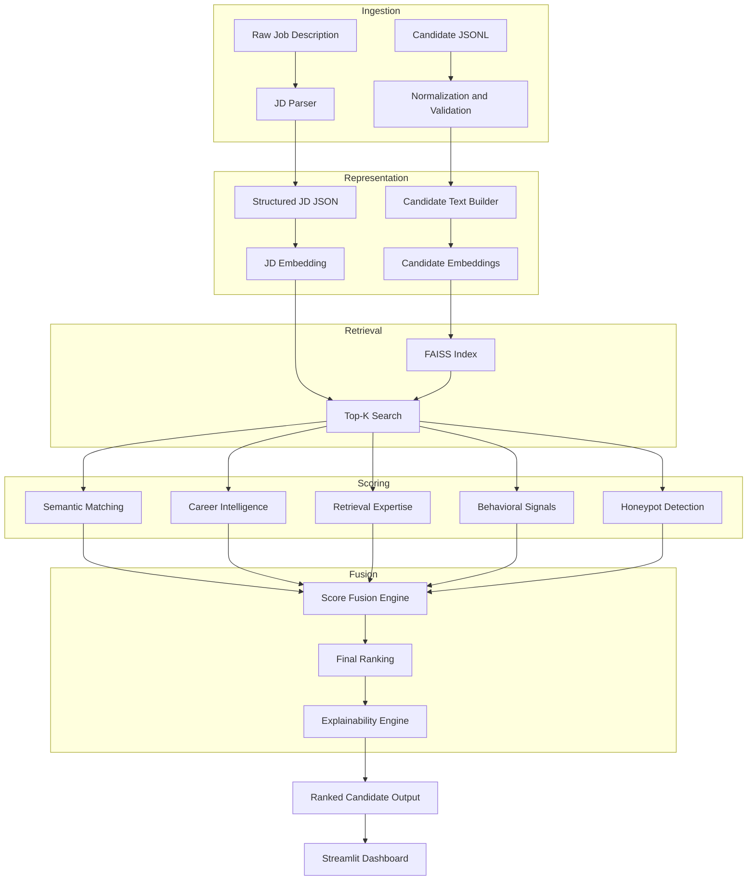
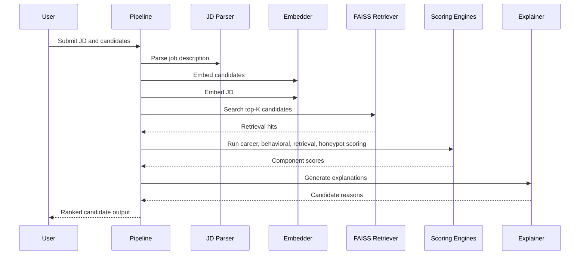

# Architecture

This document describes the MiraiKhoj system architecture, module responsibilities, and runtime flow.

## Architectural Goals

- Understand job descriptions deeply enough to recover role intent
- Retrieve candidates efficiently from 100,000+ profiles
- Rank candidates with multiple independent evidence streams
- Provide explanations that recruiters can trust
- Keep the system practical for hackathon delivery and demo deployment

## System Architecture

## Module Boundaries

### 1. Data Layer

Responsible for loading and cleaning candidate profiles from JSONL. It also constructs a canonical `candidate_text` field used consistently across embedding and retrieval.

### 2. JD Intelligence Layer

Transforms a noisy job description into structured fields such as skills, seniority, location hints, and evaluation metrics.

### 3. Embedding Layer

Generates normalized dense vectors for candidate profiles and job descriptions. The preferred model is `BAAI/bge-large-en-v1.5`, with `intfloat/e5-large-v2` as an alternative.

### 4. Retrieval Layer

Builds a FAISS index and retrieves the top-K candidates for a given JD embedding. This step narrows the search space before expensive scoring logic runs.

### 5. Career Intelligence Layer

Scores actual experience, growth patterns, company quality, and role relevance. This is the main guardrail against pure keyword matching.

### 6. Behavioral Intelligence Layer

Uses availability, recruitability, engagement, and credibility signals to estimate how likely the candidate is to respond and progress.

### 7. Honeypot Detection Layer

Detects suspicious profiles, keyword stuffing, fake seniority, and consulting-only patterns.

### 8. Ranking Layer

Fuses all scores into a final output using a weighted formula.

### 9. Explainability Layer

Produces human-readable reasons that can be shown to recruiters and judges.

## Runtime Flow

1. The system ingests a candidate JSONL file.
2. Candidate records are normalized and converted into canonical text.
3. The embedding engine generates candidate vectors and stores them on disk.
4. The FAISS index is built or refreshed.
5. A job description is parsed into structured signals.
6. The JD is embedded and used to search the candidate index.
7. The top retrieval set is evaluated across multiple scoring modules.
8. The fusion engine computes the final score.
9. The explanation engine renders recruiter-friendly reasoning.
10. Ranked output is written to disk and visualized in the dashboard.

## Mermaid Sequence Diagram

## Scalability Notes

- FAISS retrieval is used to avoid scoring every profile in the full corpus.
- Candidate embeddings are normalized so inner-product search is equivalent to cosine similarity.
- The architecture is modular, which makes it easy to swap in a stronger embedding or retrieval backend later.
- The scoring stages are deterministic and lightweight enough for challenge demos.

## Extension Points

- Replace rule-based JD parsing with an LLM-backed parser.
- Replace lexical retrieval expertise detection with a learned classifier.
- Add incremental FAISS updates for streaming profile ingestion.
- Add richer behavioral features from CRM or ATS telemetry.
- Add a calibrated learning-to-rank layer on top of the current score fusion.
