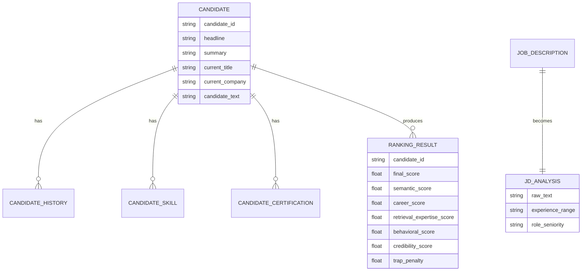

# Data Schema

This document defines the candidate and ranking data structures used by MiraiKhoj.

## Data Philosophy

MiraiKhoj is designed to tolerate noisy and incomplete profile data. Missing fields should not break the pipeline. Instead, the system should degrade gracefully and keep processing valid records.

## Candidate Input Schema

The primary input file is a JSONL file, where each line is a single candidate record.

### Core Fields

| Field | Type | Required | Description |
| --- | --- | --- | --- |
| `candidate_id` | string | Recommended | Stable unique identifier for the candidate |
| `headline` | string | No | Short positioning statement |
| `summary` | string | No | Profile summary or bio |
| `current_title` | string | No | Most recent title |
| `current_company` | string | No | Most recent employer |
| `career_history` | array or string | No | Prior roles, companies, or experience entries |
| `skills` | array or string | No | Candidate skills and technologies |
| `certifications` | array or string | No | Certifications or credentials |

### Optional Behavioral Fields

| Field | Type | Description |
| --- | --- | --- |
| `open_to_work` | boolean or numeric | Availability signal |
| `response_rate` | number | Recruiter response behavior |
| `interview_completion` | number | Interview progress signal |
| `recruiter_interest` | number | External recruiter interest proxy |
| `profile_completeness` | number | Completeness or quality indicator |
| `github_activity` | number | Public engineering activity signal |
| `linkedin_connection` | number | Social proof proxy |
| `recent_activity` | number | Recency of visible activity |
| `location` | string | Preferred or current location |
| `notice_period_days` | number | Notice period used for logistics scoring |

## Normalized Candidate Record

During preprocessing, every candidate is normalized into a canonical structure.

### Derived Fields

| Field | Type | Description |
| --- | --- | --- |
| `candidate_text` | string | Canonical text representation built from headline, summary, role, history, skills, and certifications |
| `raw_record` | object | Original source record preserved for traceability |

### Canonical Text Layout

The canonical `candidate_text` is built in this order:

1. Headline
2. Summary
3. Current role
4. Career history
5. Skills
6. Certifications

This ensures that the embedding model receives a consistent representation regardless of source variation.

## JD Parsed Schema

The JD parser returns a structured JSON object with the following shape:

| Field | Type | Description |
| --- | --- | --- |
| `required_skills` | array of strings | Skills inferred as required from the JD |
| `preferred_skills` | array of strings | Nice-to-have skills |
| `experience_range` | string | Extracted experience requirement |
| `locations` | array of strings | Location and work-mode hints |
| `role_seniority` | string | Seniority inferred from the JD |
| `domain_keywords` | array of strings | Domain-specific concepts such as search, ranking, or recommendation |
| `evaluation_metrics` | array of strings | Metrics such as NDCG, MRR, or MAP |
| `raw_text` | string | Cleaned JD text |

## Ranking Output Schema

The final ranking output is a list of candidate objects.

| Field | Type | Description |
| --- | --- | --- |
| `candidate_id` | string | Candidate identifier |
| `final_score` | number | Weighted overall rank score |
| `semantic_score` | number | Semantic similarity score |
| `career_score` | number | Career fit score |
| `retrieval_expertise_score` | number | Retrieval/search expertise score |
| `behavioral_score` | number | Recruitability and engagement score |
| `credibility_score` | number | Profile credibility score |
| `logistics_score` | number | Availability and location fit score |
| `trap_penalty` | number | Honeypot penalty score |
| `candidate_reason` | string | Human-readable explanation |
| `candidate` | object | Full candidate payload used in scoring |

## Data Quality Rules

- Invalid JSONL rows should be skipped and logged.
- Missing fields should default to empty strings or empty collections.
- Embedding generation should always run on the cleaned canonical text.
- Retrieval should only operate on valid normalized candidates.
- Final ranking should never fail because a single profile is incomplete.

## Mermaid Data Model

