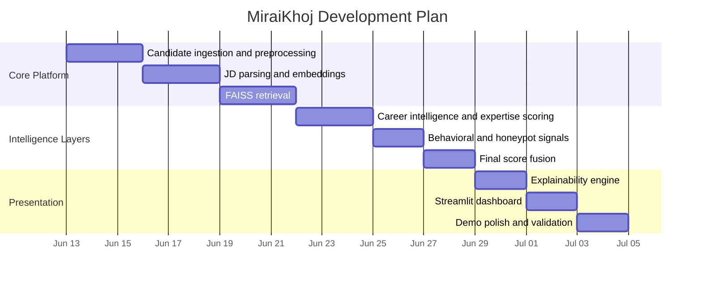

# Development Plan

This plan describes how MiraiKhoj can be built, validated, and extended in a production-oriented way for the Redrob Data & AI Challenge.

## Phase 1: Core Pipeline

### Goals

- Implement candidate ingestion and cleaning
- Parse job descriptions into structured signals
- Generate embeddings for JD and candidate profiles
- Build a retrieval index with FAISS

### Deliverables

- JSONL loader
- Candidate text construction
- JD parser
- Embedding engine
- FAISS build and search workflow

## Phase 2: Multi-Signal Ranking

### Goals

- Add career intelligence scoring
- Add retrieval expertise detection
- Add behavioral signal scoring
- Add honeypot detection
- Fuse all signals into a final ranking

### Deliverables

- Weighted score fusion
- Normalized score ranges
- Candidate ranking output
- Intermediate score breakdowns

## Phase 3: Explainability and UI

### Goals

- Produce recruiter-friendly explanations
- Surface score details in a dashboard
- Make the workflow easy to demo for judges

### Deliverables

- Explanation engine
- Streamlit dashboard
- Downloadable ranked output

## Phase 4: Production Hardening

### Goals

- Improve error handling
- Add incremental index updates
- Add better observability
- Add test coverage and dataset fixtures

### Deliverables

- Structured logging
- Validation checks
- Regression tests
- Safer ingestion for large and noisy datasets

## Phase 5: Model and Ranking Improvements

### Goals

- Replace heuristics with stronger learned components where available
- Calibrate the fusion formula using validation data
- Tune retrieval and reranking thresholds

### Deliverables

- Learned JD parser
- Candidate reranker
- More advanced behavioral scoring
- Better calibration against judge feedback

## Timeline View

## Implementation Priorities

### Must Have for Challenge Submission

- Working candidate ingestion
- JD parsing
- Embedding generation
- FAISS retrieval
- Final ranking output
- Explainability
- Streamlit demo

### Strongly Recommended

- Evaluation dataset and smoke tests
- Sample candidate corpus
- Configurable model selection
- Cached artifacts for fast repeated demos

### Nice to Have

- Incremental FAISS updates
- Learned reranker
- Audit logs for score explanations
- Bias and fairness reporting

## Validation Checklist

Before submission, validate the following:

- Candidate ingestion handles malformed rows
- JD parser returns structured JSON
- Embedding generation works with fallback backends
- Retrieval returns top-K candidates
- Final ranking output is sorted correctly
- Explanations are readable and consistent
- Streamlit app renders without manual patching

## Risk Management

| Risk | Mitigation |
| --- | --- |
| Missing optional ML dependencies | Use fallback embedding backend and clear installation instructions |
| Noisy profile data | Defensive parsing and error logging |
| Sparse candidate metadata | Use graceful default scores |
| Overfitting to keywords | Use semantic and career signals as the primary ranking drivers |
| Low demo reliability | Cache artifacts and keep the UI simple |
