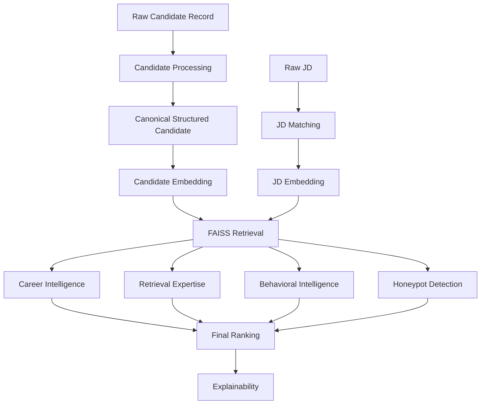

# MiraiKhoj Implementation Plan

**Project:** MiraiKhoj  
**Tagline:** _Finding Talent Beyond Keywords._  
**Context:** Redrob Data & AI Challenge

## Purpose

This plan translates the actual Redrob dataset structure into a module-by-module implementation strategy for MiraiKhoj.

It is intentionally aligned to the real schema described in [ACTUAL_DATASET_ANALYSIS.md](ACTUAL_DATASET_ANALYSIS.md) and the gap findings in [CODE_SCHEMA_GAP_ANALYSIS.md](CODE_SCHEMA_GAP_ANALYSIS.md).

The goal is to ensure that every dataset field is assigned a clear purpose in the system, every scoring component is grounded in available data, and the final ranking formula remains explainable for judges and recruiters.

## Implementation Principles

1. Preserve structured data as long as possible.
2. Use profile, career, education, skill, and signal objects as first-class inputs.
3. Use candidate text only as a downstream representation for embeddings and explanation support.
4. Treat `redrob_signals` as a core ranking input, not a side feature.
5. Separate semantic retrieval from career intelligence and behavioral scoring.
6. Prefer deterministic, auditable scoring rules for challenge submission.

## Target Module Map

| Module | Responsibility | Primary Inputs | Primary Output |
| --- | --- | --- | --- |
| Candidate Processing | Normalize raw records and preserve structure | `profile`, `career_history`, `education`, `skills`, `certifications`, `languages`, `redrob_signals` | Canonical candidate representation |
| JD Matching | Parse job description into structured needs | Raw JD text | Structured JD profile |
| Career Intelligence | Evaluate actual role fit and progression | `profile`, `career_history`, `education`, `skills` | `career_score` |
| Retrieval Expertise | Detect search / ranking / recommendation experience | `career_history`, `skills`, `certifications`, `profile` | `retrieval_expertise_score` |
| Behavioral Intelligence | Use Redrob signals to estimate recruitability | `redrob_signals` | `behavioral_score`, `credibility_score`, `logistics_score` |
| Honeypot Detection | Penalize stuffing, inconsistency, and fraud risk | `profile`, `career_history`, `education`, `skills`, `certifications`, `redrob_signals` | `trap_penalty` |
| Explainability | Convert scores into recruiter-readable reasons | All upstream outputs | `candidate_reason` |
| Final Ranking | Fuse all module scores | All score outputs | `final_score` and ordering |

## Dataset Field to Module Map

The following table maps every schema field to the module that should own or consume it.

### Top-Level Fields

| Dataset Field | Module | Use in System | Notes |
| --- | --- | --- | --- |
| `candidate_id` | Candidate Processing, Explainability, Final Ranking | Stable join key across all stages | Must preserve the schema pattern `CAND_0000001` style |
| `profile` | Candidate Processing | Main identity and current-role source | Should be unpacked into first-class subfields |
| `career_history` | Candidate Processing, Career Intelligence, Retrieval Expertise, Honeypot Detection | Experience chronology and evidence source | Keep as structured array until scoring |
| `education` | Candidate Processing, Career Intelligence, Honeypot Detection | Academic signal and prestige proxy | Preserve structured entries |
| `skills` | Candidate Processing, Career Intelligence, Retrieval Expertise, JD Matching, Explainability | Skill relevance, proficiency, endorsements | Keep per-skill attributes |
| `certifications` | Candidate Processing, Career Intelligence, Retrieval Expertise, Honeypot Detection | Proof of specialization | Optional but useful when present |
| `languages` | Candidate Processing, Behavioral Intelligence, Explainability | Mobility, market fit, communication context | Optional but should be preserved |
| `redrob_signals` | Behavioral Intelligence, Honeypot Detection, Explainability | Recruitability and trust signals | Core ranking input |

### `profile` Subfields

| Dataset Field | Module | Use in System | Notes |
| --- | --- | --- | --- |
| `profile.anonymized_name` | Candidate Processing, Explainability | Human-readable label in UI and reports | Not used for scoring to avoid identity leakage |
| `profile.headline` | Candidate Processing, JD Matching, Career Intelligence, Retrieval Expertise | Candidate summary text and semantic relevance | Strong semantic signal |
| `profile.summary` | Candidate Processing, JD Matching, Career Intelligence, Explainability | Candidate text and narrative fit | Strong semantic and career signal |
| `profile.location` | Behavioral Intelligence, Explainability | Location fit and relocation context | Use with `preferred_work_mode` and `willing_to_relocate` |
| `profile.country` | Behavioral Intelligence, Explainability | Geography and hiring-region context | Useful for logistics and filtering |
| `profile.years_of_experience` | Career Intelligence, JD Matching | Seniority alignment and role fit | Important structured numeric signal |
| `profile.current_title` | Candidate Processing, Career Intelligence, Retrieval Expertise, Explainability | Role relevance and current-position fit | High-weight career signal |
| `profile.current_company` | Candidate Processing, Career Intelligence, Honeypot Detection | Company quality and role context | Use with industry and size |
| `profile.current_company_size` | Career Intelligence, Honeypot Detection | Company-quality and scale proxy | Useful for product-company vs consulting patterns |
| `profile.current_industry` | Career Intelligence, RetrievaI Expertise, Honeypot Detection | Domain fit and industry depth | Important for career fit |

### `career_history` Subfields

| Dataset Field | Module | Use in System | Notes |
| --- | --- | --- | --- |
| `career_history[].company` | Candidate Processing, Career Intelligence, Honeypot Detection | Employer history and company quality | Used to infer product/company context |
| `career_history[].title` | Candidate Processing, Career Intelligence, Retrieval Expertise | Role progression and expertise signals | Crucial for fit analysis |
| `career_history[].start_date` | Candidate Processing, Career Intelligence, Honeypot Detection | Sequence and timeline validation | Used for chronology checks |
| `career_history[].end_date` | Candidate Processing, Career Intelligence, Honeypot Detection | Timeline completeness and current-role detection | Null indicates current role |
| `career_history[].duration_months` | Career Intelligence, Honeypot Detection | Stability and progression length | Useful for seniority checks |
| `career_history[].is_current` | Candidate Processing, Career Intelligence | Identify active role | Also supports recency weighting |
| `career_history[].industry` | Career Intelligence, Honeypot Detection | Industry consistency and fit | Important for domain alignment |
| `career_history[].company_size` | Career Intelligence, Honeypot Detection | Company-quality proxy | Helps distinguish product vs services paths |
| `career_history[].description` | Candidate Processing, JD Matching, Career Intelligence, Retrieval Expertise, Honeypot Detection, Explainability | Narrative evidence for role fit and expertise | High-value text source for embeddings |

### `education` Subfields

| Dataset Field | Module | Use in System | Notes |
| --- | --- | --- | --- |
| `education[].institution` | Candidate Processing, Career Intelligence, Honeypot Detection | Academic pedigree and consistency | Use cautiously as a weak proxy |
| `education[].degree` | Candidate Processing, Career Intelligence | Degree level and specialization | Supports seniority and qualification checks |
| `education[].field_of_study` | Candidate Processing, Career Intelligence, JD Matching | Domain alignment | Useful for AI/ML, CS, math, etc. |
| `education[].start_year` | Candidate Processing, Honeypot Detection | Timeline consistency | Helps detect impossible histories |
| `education[].end_year` | Candidate Processing, Honeypot Detection | Timeline consistency | Helps validate career chronology |
| `education[].grade` | Career Intelligence, Honeypot Detection | Academic performance proxy | Low-to-moderate weight |
| `education[].tier` | Career Intelligence, Honeypot Detection | Institution prestige proxy | Should be used softly, not deterministically |

### `skills` Subfields

| Dataset Field | Module | Use in System | Notes |
| --- | --- | --- | --- |
| `skills[].name` | Candidate Processing, JD Matching, Career Intelligence, Retrieval Expertise, Explainability | Core skill matching and evidence extraction | Strongest skill-level signal |
| `skills[].proficiency` | Career Intelligence, Retrieval Expertise, Honeypot Detection | Skill depth and credibility | Useful for weighting actual strength |
| `skills[].endorsements` | Career Intelligence, Behavioral Intelligence, Honeypot Detection | Signal strength / confidence | Can be used as a trust proxy |
| `skills[].duration_months` | Career Intelligence, Retrieval Expertise | Experience depth for a skill | Helps distinguish exposure from expertise |

### `certifications` Subfields

| Dataset Field | Module | Use in System | Notes |
| --- | --- | --- | --- |
| `certifications[].name` | Candidate Processing, Career Intelligence, Retrieval Expertise, Explainability | Specialty proof and evidence | Useful when relevant to AI, cloud, or data |
| `certifications[].issuer` | Career Intelligence, Honeypot Detection | Certification credibility | Better issuers should contribute more |
| `certifications[].year` | Career Intelligence, Honeypot Detection | Recency and relevance | Older certs should decay in weight |

### `languages` Subfields

| Dataset Field | Module | Use in System | Notes |
| --- | --- | --- | --- |
| `languages[].language` | Candidate Processing, Behavioral Intelligence, Explainability | Communication and market-fit context | Mostly non-scoring unless required by JD |
| `languages[].proficiency` | Behavioral Intelligence, Explainability | Location / role fit and recruiter context | Useful for cross-border hiring |

### `redrob_signals` Subfields

| Dataset Field | Module | Use in System | Notes |
| --- | --- | --- | --- |
| `redrob_signals.profile_completeness_score` | Behavioral Intelligence, Honeypot Detection | Profile quality and trust | Strong positive credibility signal |
| `redrob_signals.signup_date` | Behavioral Intelligence | Account recency | Newer signups may need caution or decay rules |
| `redrob_signals.last_active_date` | Behavioral Intelligence | Recency / availability proxy | Strong engagement signal |
| `redrob_signals.open_to_work_flag` | Behavioral Intelligence, Explainability | Direct availability signal | Should heavily influence logistics score |
| `redrob_signals.profile_views_received_30d` | Behavioral Intelligence | Visibility and market interest | Useful recruiter-demand proxy |
| `redrob_signals.applications_submitted_30d` | Behavioral Intelligence | Candidate activity | Helps distinguish passive vs active candidates |
| `redrob_signals.recruiter_response_rate` | Behavioral Intelligence | Recruitability | Strong signal of engagement and responsiveness |
| `redrob_signals.avg_response_time_hours` | Behavioral Intelligence | Recruitability | Lower is better; should be normalized inversely |
| `redrob_signals.skill_assessment_scores` | Career Intelligence, Behavioral Intelligence | Skill validation | Use as direct skill-confidence booster |
| `redrob_signals.connection_count` | Behavioral Intelligence, Honeypot Detection | Social proof | Weak-to-moderate credibility signal |
| `redrob_signals.endorsements_received` | Behavioral Intelligence, Career Intelligence | Trust / proof of skill | Helpful when consistent with profile |
| `redrob_signals.notice_period_days` | Behavioral Intelligence, Explainability | Logistics / availability | Lower notice period is better |
| `redrob_signals.expected_salary_range_inr_lpa` | Behavioral Intelligence, Explainability | Logistics / comp fit | Use for range match only, not absolute rank dominance |
| `redrob_signals.preferred_work_mode` | Behavioral Intelligence, Explainability | Work-mode fit | Direct match with JD work-mode requirements |
| `redrob_signals.willing_to_relocate` | Behavioral Intelligence | Mobility and logistics | Should improve rank when location is constrained |
| `redrob_signals.github_activity_score` | Behavioral Intelligence, Honeypot Detection | Technical activity and proof of work | Use `-1` as missing |
| `redrob_signals.search_appearance_30d` | Behavioral Intelligence | Market visibility | Positive interest signal |
| `redrob_signals.saved_by_recruiters_30d` | Behavioral Intelligence | Recruiter demand | Strong positive interest signal |
| `redrob_signals.interview_completion_rate` | Behavioral Intelligence | Recruitability | Strong signal of process reliability |
| `redrob_signals.offer_acceptance_rate` | Behavioral Intelligence | Candidate desirability / hiring history | Treat `-1` as missing |
| `redrob_signals.verified_email` | Behavioral Intelligence, Honeypot Detection | Identity confidence | Strong trust signal |
| `redrob_signals.verified_phone` | Behavioral Intelligence, Honeypot Detection | Identity confidence | Strong trust signal |
| `redrob_signals.linkedin_connected` | Behavioral Intelligence | Social proof and account authenticity | Trust signal, not a main rank driver |

## Which Fields Should Be Used in Each Module

### Candidate Processing

Use all dataset fields, preserving structure:

- `candidate_id`
- `profile.*`
- `career_history[].*`
- `education[].*`
- `skills[].*`
- `certifications[].*`
- `languages[].*`
- `redrob_signals.*`

The processor should also derive a canonical candidate text representation, but that should remain secondary to the structured record.

### JD Matching

Use these fields from the candidate side to compare against the JD:

- `profile.headline`
- `profile.summary`
- `profile.current_title`
- `profile.current_industry`
- `career_history[].title`
- `career_history[].description`
- `skills[].name`
- `skills[].proficiency`
- `certifications[].name`
- `education[].field_of_study`

JD parsing should extract:

- required skills
- preferred skills
- experience range
- location requirements
- role seniority
- domain keywords
- evaluation metrics

### Career Intelligence

Use:

- `profile.years_of_experience`
- `profile.current_title`
- `profile.current_company`
- `profile.current_company_size`
- `profile.current_industry`
- `career_history[].title`
- `career_history[].company`
- `career_history[].industry`
- `career_history[].company_size`
- `career_history[].duration_months`
- `career_history[].description`
- `education[].tier`
- `education[].field_of_study`
- `skills[].name`
- `skills[].proficiency`
- `skills[].endorsements`
- `skills[].duration_months`
- `certifications[].name`
- `certifications[].issuer`

### Retrieval Expertise

Use:

- `profile.headline`
- `profile.summary`
- `profile.current_title`
- `career_history[].title`
- `career_history[].description`
- `skills[].name`
- `skills[].proficiency`
- `skills[].duration_months`
- `certifications[].name`

Focus especially on evidence for:

- FAISS
- Elasticsearch
- OpenSearch
- Qdrant
- Milvus
- Pinecone
- Weaviate
- BM25
- learning-to-rank
- NDCG / MRR / MAP
- A/B testing

### Behavioral Intelligence

Use the entire `redrob_signals` object, especially:

- `profile_completeness_score`
- `last_active_date`
- `open_to_work_flag`
- `recruiter_response_rate`
- `avg_response_time_hours`
- `profile_views_received_30d`
- `applications_submitted_30d`
- `skill_assessment_scores`
- `connection_count`
- `endorsements_received`
- `notice_period_days`
- `expected_salary_range_inr_lpa`
- `preferred_work_mode`
- `willing_to_relocate`
- `github_activity_score`
- `search_appearance_30d`
- `saved_by_recruiters_30d`
- `interview_completion_rate`
- `offer_acceptance_rate`
- `verified_email`
- `verified_phone`
- `linkedin_connected`

### Honeypot Detection

Use:

- all `profile` fields for consistency checks
- all `career_history` entries for timeline and title consistency
- `education[]` for impossible chronology or improbable tier jumps
- `skills[]` for stuffing patterns and improbable breadth
- `certifications[]` for suspicious cert inflation
- `redrob_signals.profile_completeness_score`
- `redrob_signals.github_activity_score`
- `redrob_signals.verified_email`
- `redrob_signals.verified_phone`
- `redrob_signals.linkedin_connected`

### Explainability

Use the top evidence from all prior modules:

- semantic alignment evidence
- career progression evidence
- retrieval expertise evidence
- behavioral signal evidence
- trust / credibility evidence
- trap penalty explanation

## Field-to-Score Mapping Table

This table defines how the dataset fields contribute to each score family.

| Score | Contributing Fields | Normalization / Interpretation |
| --- | --- | --- |
| `semantic_score` | `profile.headline`, `profile.summary`, `profile.current_title`, `career_history[].title`, `career_history[].description`, `skills[].name`, `certifications[].name`, JD embedding | Cosine similarity between candidate text embedding and JD embedding, normalized to `[0, 1]` |
| `career_score` | `profile.years_of_experience`, `profile.current_title`, `profile.current_company_size`, `profile.current_industry`, `career_history[].title`, `career_history[].industry`, `career_history[].duration_months`, `career_history[].description`, `education[].tier`, `skills[].proficiency`, `skills[].endorsements`, `skills[].duration_months`, `certifications[].name` | Weighted sub-scores for role relevance, progression, company quality, and skill depth |
| `retrieval_expertise_score` | `profile.summary`, `career_history[].description`, `skills[].name`, `skills[].proficiency`, `skills[].duration_months`, `certifications[].name` | Count and quality of retrieval/search/ranking evidence normalized to `[0, 1]` |
| `behavioral_score` | `redrob_signals.*` | Weighted availability, engagement, responsiveness, and recruiter-interest signal fusion |
| `credibility_score` | `redrob_signals.profile_completeness_score`, `redrob_signals.verified_email`, `redrob_signals.verified_phone`, `redrob_signals.linkedin_connected`, `redrob_signals.github_activity_score`, `skills[].endorsements`, `education[].tier` | Trust and profile-quality composite normalized to `[0, 1]` |
| `trap_penalty` | `profile.*`, `career_history[]`, `education[]`, `skills[]`, `certifications[]`, `redrob_signals.*` | Penalty in `[0, 1]` applied for stuffing, inconsistencies, and fraud-like patterns |

## Score Definitions

### `semantic_score`

**Definition:** semantic alignment between the JD and the candidate profile.

**Intended formula:**

$$
semantic\_score = cosine(embedding(JD), embedding(candidate\_text))
$$

**Candidate text should include:**

- profile headline
- profile summary
- current title
- career history descriptions
- skill names
- certification names

**Desired range:** `0.0` to `1.0`

### `career_score`

**Definition:** how well the actual career path fits the target role.

**Recommended sub-components:**

- `role_relevance`
- `career_progression`
- `company_quality`
- `skill_depth`
- `education_alignment`

**Suggested conceptual formula:**

$$
career\_score = 0.35 \cdot role\_relevance + 0.20 \cdot career\_progression + 0.15 \cdot company\_quality + 0.20 \cdot skill\_depth + 0.10 \cdot education\_alignment
$$

**Desired range:** `0.0` to `1.0`

### `retrieval_expertise_score`

**Definition:** specialization in search, retrieval, ranking, recommendation, or evaluation systems.

**Signals to reward:**

- explicit mentions of retrieval technologies
- ranking / relevance experience
- evaluation metrics experience
- applied systems work

**Suggested conceptual formula:**

$$
retrieval\_expertise\_score = 0.65 \cdot tech\_evidence + 0.35 \cdot eval\_evidence
$$

**Desired range:** `0.0` to `1.0`

### `behavioral_score`

**Definition:** whether the candidate appears recruitable, responsive, and likely to progress.

**Recommended sub-components:**

- `availability_score`
- `recruitability_score`
- `engagement_score`
- `credibility_score`

**Suggested conceptual formula:**

$$
behavioral\_score = 0.30 \cdot availability + 0.30 \cdot recruitability + 0.20 \cdot engagement + 0.20 \cdot credibility
$$

**Desired range:** `0.0` to `1.0`

### `credibility_score`

**Definition:** confidence that the profile is real, complete, and internally consistent.

**Recommended sub-components:**

- profile completeness
- verification flags
- public activity
- endorsements
- coherent timeline

**Suggested conceptual formula:**

$$
credibility\_score = 0.35 \cdot completeness + 0.20 \cdot verification + 0.15 \cdot activity + 0.15 \cdot endorsements + 0.15 \cdot timeline\_consistency
$$

**Desired range:** `0.0` to `1.0`

### `trap_penalty`

**Definition:** penalty for suspicious or manipulative profile patterns.

**Recommended penalty triggers:**

- keyword stuffing
- inflated seniority claims with weak experience
- consulting-only history when targeting product or engineering roles
- impossible timeline overlap
- inconsistent title / company / industry patterns
- improbable skill breadth with shallow durations
- verification deficits combined with unusually polished claims

**Suggested conceptual formula:**

$$
trap\_penalty = \min(1.0, stuffing + inconsistency + consulting\_pattern + verification\_risk)
$$

**Desired range:** `0.0` to `1.0`

## Recommended Final Score Weights

These weights are recommended for the challenge submission because they preserve the project’s core philosophy while keeping the ranking explainable.

| Component | Weight | Rationale |
| --- | --- | --- |
| `semantic_score` | `0.40` | Primary gate for JD relevance |
| `career_score` | `0.22` | Ensures actual experience fit is rewarded |
| `retrieval_expertise_score` | `0.15` | Important for search, ranking, and recommendation roles |
| `behavioral_score` | `0.12` | Captures recruiter feasibility and engagement |
| `credibility_score` | `0.06` | Protects against weak or incomplete profiles |
| `logistics_score` | `0.05` | Captures availability and work-mode fit |
| `trap_penalty` | subtractive | Applied after weighted fusion |

### Recommended Final Formula

$$
final\_score = 0.40 \cdot semantic\_score + 0.22 \cdot career\_score + 0.15 \cdot retrieval\_expertise\_score + 0.12 \cdot behavioral\_score + 0.06 \cdot credibility\_score + 0.05 \cdot logistics\_score - trap\_penalty
$$

## Module-by-Module Implementation Order

### Phase 1: Data Fidelity

1. Parse `profile` into structured fields.
2. Preserve `career_history`, `education`, `skills`, `certifications`, `languages`, and `redrob_signals` exactly as nested data.
3. Create a canonical candidate text field only after structured preservation.

### Phase 2: JD Understanding

1. Parse the JD into required skills, preferred skills, experience range, role seniority, location, and evaluation metrics.
2. Normalize JD text for embedding.

### Phase 3: Retrieval and Reranking

1. Generate candidate embeddings from canonical text.
2. Retrieve top-K candidates with FAISS.
3. Compute `semantic_score` for retrieved candidates.
4. Run career and retrieval expertise scoring on the retrieved set.

### Phase 4: Behavioral and Fraud Signals

1. Consume all `redrob_signals` fields.
2. Compute availability, recruitability, engagement, credibility, and logistics.
3. Compute trap penalties using structured and text-based consistency checks.

### Phase 5: Final Ranking and Explainability

1. Fuse the scores with the recommended weights.
2. Generate ranked output.
3. Emit explanations that cite the strongest signals and penalties.

## Mermaid Implementation Flow

## Success Criteria

The implementation should be considered aligned when:

- every schema field has a clear owner module,
- no required field is silently dropped,
- scoring uses the actual Redrob signals,
- career and behavioral ranking are grounded in structured data,
- and explanations are understandable to non-technical reviewers.
