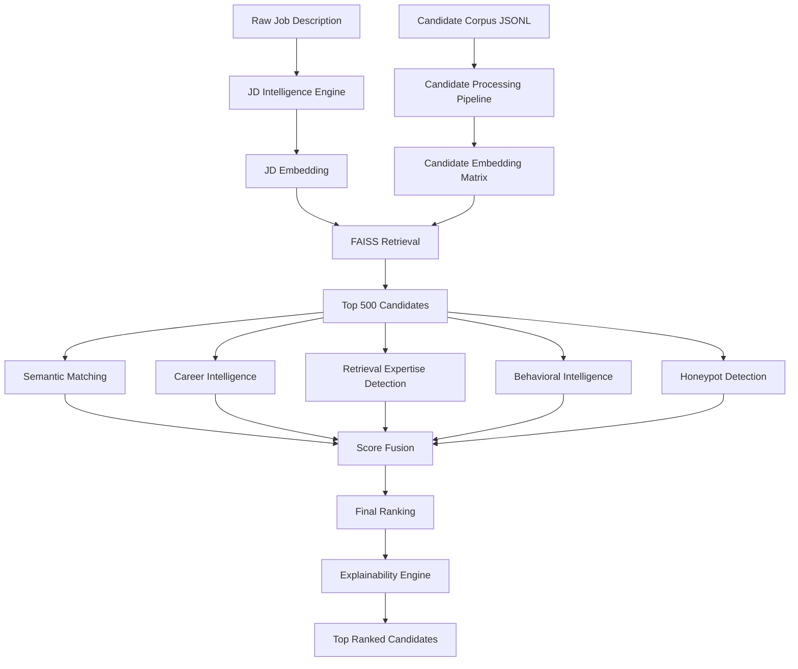

# MiraiKhoj Documentation

**MiraiKhoj**

**Tagline:** _Finding Talent Beyond Keywords._

MiraiKhoj is an intelligent candidate discovery and ranking system built for the Redrob Data & AI Challenge. It is designed to help recruiters discover highly relevant candidates from large profile pools by combining semantic retrieval, career intelligence, behavioral signal analysis, honeypot detection, and explainable score fusion.

This documentation set is written for judges, recruiters, and developers who need to understand how MiraiKhoj works, how data flows through the system, and how the final rankings are produced.

## Documentation Map

- [Project Overview](PROJECT_OVERVIEW.md)
- [Architecture](ARCHITECTURE.md)
- [Data Schema](DATA_SCHEMA.md)
- [Scoring Methodology](SCORING_METHODOLOGY.md)
- [Development Plan](DEVELOPMENT_PLAN.md)
- [API Reference](API_REFERENCE.md)

## What MiraiKhoj Does

MiraiKhoj accepts a raw job description and a candidate corpus, then performs the following pipeline:

1. Parse the job description into structured hiring signals.
2. Normalize candidate profiles and build a canonical candidate text representation.
3. Generate embeddings for the job description and each candidate profile.
4. Retrieve the most promising candidates using FAISS.
5. Score candidates across semantic, career, retrieval expertise, behavioral, credibility, and honeypot dimensions.
6. Fuse the scores into a final ranking.
7. Generate human-readable reasons for each ranking decision.

## Design Principles

- **Beyond Keywords:** Rankings are not driven by raw token overlap alone.
- **Explainability First:** Every top candidate should have a recruiter-readable reason.
- **Modular Architecture:** Each capability is isolated in its own module.
- **Scale Awareness:** The workflow is designed for 100,000+ candidate profiles.
- **Hackathon Practicality:** The system supports fast demonstration, local deployment, and iterative enhancement.

## Primary Outputs

- Processed candidate dataset
- Candidate embedding matrix
- FAISS retrieval index
- Ranked candidate list
- Explanation strings for each ranked result
- Streamlit demo dashboard

## Core Modules

- `data`: loading, validation, and preprocessing of candidate records
- `jd`: job description parsing and structure extraction
- `embeddings`: embedding generation for candidates and JDs
- `retrieval`: FAISS index building and search
- `career`: career fit and retrieval expertise scoring
- `behavior`: recruitability, availability, and credibility signals
- `ranking`: semantic scoring and final fusion
- `explainability`: narrative explanation generation
- `main_pipeline`: end-to-end orchestration

## Mermaid Flow

## Suggested Reading Order

If you are new to the project, read these files in sequence:

1. [PROJECT_OVERVIEW.md](PROJECT_OVERVIEW.md)
2. [ARCHITECTURE.md](ARCHITECTURE.md)
3. [DATA_SCHEMA.md](DATA_SCHEMA.md)
4. [SCORING_METHODOLOGY.md](SCORING_METHODOLOGY.md)
5. [API_REFERENCE.md](API_REFERENCE.md)
6. [DEVELOPMENT_PLAN.md](DEVELOPMENT_PLAN.md)
