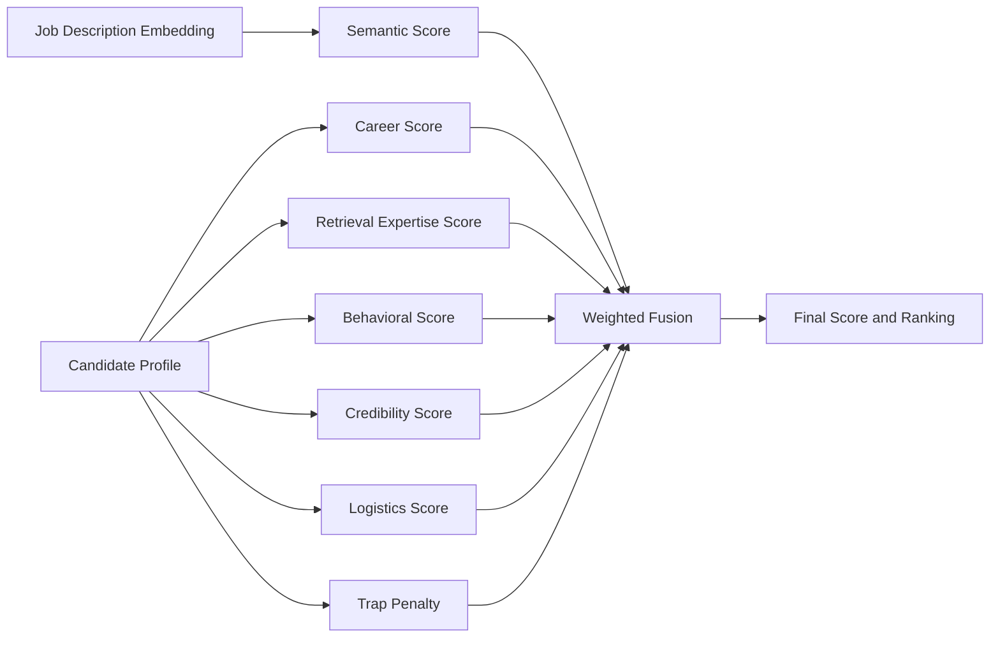

# Scoring Methodology

MiraiKhoj is designed to rank candidates using multiple independent signals rather than a single similarity score.

## Scoring Objectives

The scoring system prioritizes candidates who are:

- semantically aligned with the job description,
- actually experienced in the relevant career path,
- familiar with retrieval, search, ranking, or recommendation systems,
- likely to be recruitable and responsive,
- credible and profile-complete,
- and not suspiciously overstated or stuffed with keywords.

## Component Scores

### 1. Semantic Score

Semantic score measures the cosine similarity between the job description embedding and the candidate embedding.

- Range: `0.0` to `1.0`
- Higher is better
- Computed after embeddings are normalized

### 2. Career Score

Career score captures whether the candidate’s actual experience aligns with the role.

Signals include:

- title relevance
- career progression
- company quality
- industry fit
- evidence of applied retrieval or ranking work

### 3. Retrieval Expertise Score

This score rewards hands-on experience with retrieval systems and ranking evaluation.

Recognized technologies include:

- FAISS
- Elasticsearch
- OpenSearch
- Qdrant
- Milvus
- Pinecone
- Weaviate

Recognized evaluation concepts include:

- NDCG
- MRR
- MAP
- Learning-to-Rank
- A/B testing

### 4. Behavioral Score

Behavioral score estimates recruitability using signals such as:

- open to work
- response rate
- interview completion
- recruiter interest
- profile completeness
- GitHub activity
- LinkedIn connection strength
- recent activity

### 5. Credibility Score

Credibility score reflects the reliability of the profile and behavioral data.

It is influenced by:

- completeness of the profile
- visible engineering activity
- social proof signals
- consistency of the information

### 6. Logistics Score

Logistics score captures practical hiring constraints such as:

- availability
- open-to-work status
- location fit
- notice period

### 7. Trap Penalty

Trap penalty is used to reduce the score of suspicious profiles.

It can be triggered by:

- keyword stuffing
- exaggerated self-description
- fake seniority patterns
- consulting-only histories
- sparse or inconsistent profiles

## Final Score Formula

MiraiKhoj uses weighted score fusion:

$$
\text{final\_score} =
0.45 \cdot \text{semantic\_score} +
0.20 \cdot \text{career\_score} +
0.15 \cdot \text{retrieval\_expertise\_score} +
0.10 \cdot \text{behavioral\_score} +
0.05 \cdot \text{credibility\_score} +
0.05 \cdot \text{logistics\_score} - \text{trap\_penalty}
$$

The score is clipped to the range `0.0` to `1.0` after fusion.

## Why This Weighting Works

### Semantic Alignment Gets the Largest Weight

The job description and candidate profile must be directionally aligned. This is the primary filter.

### Career Fit Matters More Than Surface Similarity

A candidate should not rank highly only because they mention a few matching words. The actual career path matters.

### Retrieval Expertise Is a Differentiator

For search, ranking, and recommendation roles, hands-on retrieval expertise should substantially improve rank.

### Behavioral and Credibility Signals Reduce False Positives

A strong technical match may still be a poor recruiting match if the candidate is inactive, unavailable, or unreliable.

### Trap Penalty Prevents Gaming

Profiles that look artificially optimized should be penalized rather than rewarded.

## Score Interpretation Guide

| Final Score | Interpretation |
| --- | --- |
| `0.85 - 1.00` | Exceptional match |
| `0.70 - 0.85` | Strong match |
| `0.55 - 0.70` | Relevant candidate worth review |
| `0.40 - 0.55` | Weak-to-moderate fit |
| `< 0.40` | Low priority |

## Mermaid Score Flow

## Explainability Policy

Every ranked candidate should be accompanied by a short explanation that references the strongest positive signals and, when applicable, any penalties applied.

The explanation should be:

- concise,
- recruiter-friendly,
- grounded in observed signals,
- and free from model hallucination.
